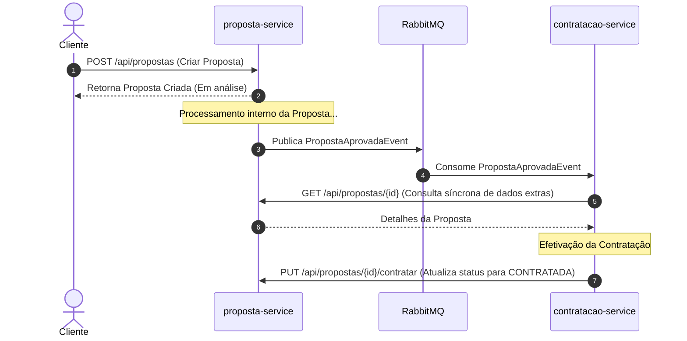

# Seguradora Microservices (Propostas e Contratação)

Este projeto implementa um ecossistema de microserviços para simular o fluxo de **criação de propostas de seguro** e a posterior **efetivação da contratação**. A arquitetura foi desenvolvida utilizando conceitos de **Arquitetura Hexagonal (Ports and Adapters)**, garantindo desacoplamento do domínio de negócio das tecnologias de infraestrutura.

---

## 🛠️ Tecnologias Utilizadas

- **Java 17**
- **Spring Boot 3.3.1**
  - Spring MVC (REST APIs)
  - Spring Data JPA
  - Spring AMQP (RabbitMQ Integration)
  - Spring RestClient (Comunicação Síncrona)
- **Banco de Dados**: PostgreSQL (Produção) & H2 Database (Testes Integrados)
- **Migrations**: Flyway
- **Mensageria**: RabbitMQ
- **Containers**: Docker & Docker Compose
- **Testes**: JUnit 5, Mockito & Spring Boot Test

---

## 📐 Arquitetura do Sistema

Os microserviços seguem os princípios da **Arquitetura Hexagonal**:

```text
       [ Entrada: REST API / Messaging ]
                     │
                     ▼
           [ Ports (Inbound) ]
                     │
                     ▼
        [ Domain (Services & Models) ]
                     │
                     ▼
          [ Ports (Outbound) ]
                     │
                     ▼
    [ Adapters (JPA, DB, REST Clients, RabbitMQ) ]
```

- **Domain**: Contém as entidades de negócio, regras de negócio puras (sem dependências de frameworks) e interfaces (ports) que definem como o sistema se comunica com o mundo externo.
- **Ports**:
  - **Inbound Ports**: Casos de uso (Use Cases) definindo o que o sistema pode fazer.
  - **Outbound Ports**: Interfaces para operações de persistência e comunicação externa.
- **Adapters**: Implementações concretas de banco de dados (JPA), envio e recebimento de mensagens (RabbitMQ), comunicação HTTP (RestClient) e controllers REST.

---

## 📦 Microserviços

O ecossistema é composto por dois serviços principais operando de forma assíncrona:

### 1. `proposta-service`
Gerencia o ciclo de vida inicial das propostas de seguros.
- **Fluxo**: Recebe requisições de propostas via API REST, persiste-as no banco PostgreSQL, avalia a elegibilidade e publica o evento `PropostaAprovadaEvent` no RabbitMQ quando a proposta for aprovada/concluída.
- **Porta padrão**: `8081`

### 2. `contratacao-service`
Consome as propostas prontas para contratação e efetiva a apólice.
- **Fluxo**: Escuta a fila do RabbitMQ. Ao receber um evento `PropostaAprovadaEvent`, consome detalhes complementares da proposta via chamada HTTP REST síncrona de volta ao `proposta-service` e efetiva a contratação no banco de dados.
- **Porta padrão**: `8082`

---

## 🔄 Fluxo de Integração



---

## 🚀 Como Executar

### Pré-requisitos
- Docker e Docker Compose instalados.
- JDK 17 e Maven (caso queira rodar localmente sem Docker).

### Passo 1: Inicializar a Infraestrutura (Postgres e RabbitMQ)
Na raiz do projeto, execute o comando para subir o banco de dados PostgreSQL e o broker do RabbitMQ:
```bash
docker-compose up -d
```

### Passo 2: Construir os Serviços
Execute o empacotamento Maven para gerar os executáveis `.jar`:
```bash
mvn clean package -DskipTests
```

### Passo 3: Executar Localmente
Você pode iniciar os serviços java via terminal:

**Iniciando proposta-service:**
```bash
cd proposta-service
mvn spring-boot:run
```

**Iniciando contratacao-service:**
```bash
cd contratacao-service
mvn spring-boot:run
```

---

## 🚦 Endpoints e Utilização

### 1. Criar Proposta (`proposta-service`)
**Requisição:**
* **URL**: `POST http://localhost:8081/api/propostas`
* **Body (JSON)**:
```json
{
  "clienteNome": "Aminadabes Filho",
  "clienteCpf": "12345678900",
  "valorSegurado": 150000.00,
  "tipoSeguro": "AUTOMOTIVO"
}
```

### 2. Consultar Proposta (`proposta-service`)
**Requisição:**
* **URL**: `GET http://localhost:8081/api/propostas/{id}`

### 3. Efetivar Contratação Manualmente (Opcional)
Normalmente, a contratação é engatilhada automaticamente pelo evento assíncrono. No entanto, é possível forçar o fluxo:
* **URL**: `PUT http://localhost:8081/api/propostas/{id}/contratar`

---

## 🧪 Testes

Os serviços possuem testes unitários e testes integrados (utilizando H2 Database em memória para isolamento dos testes). Para executá-los:

```bash
mvn test
```
